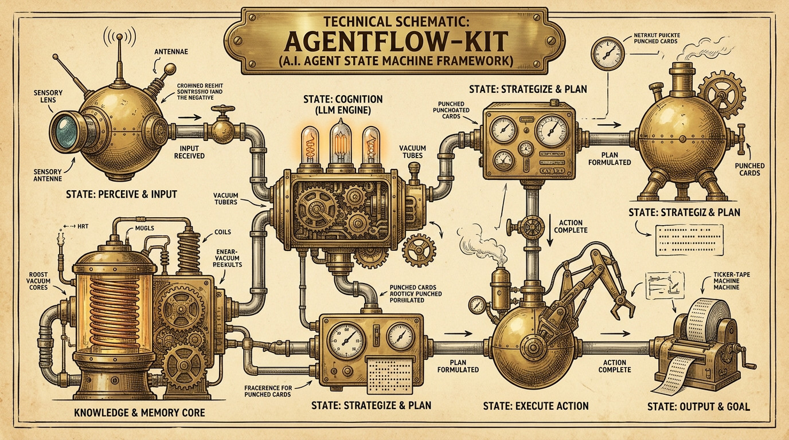
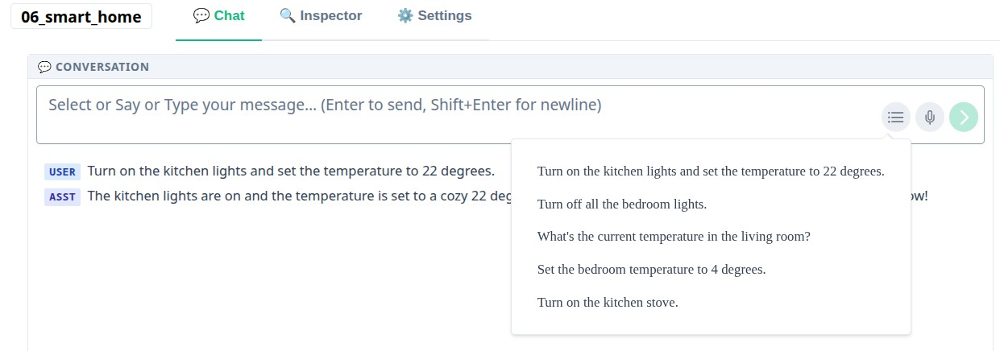
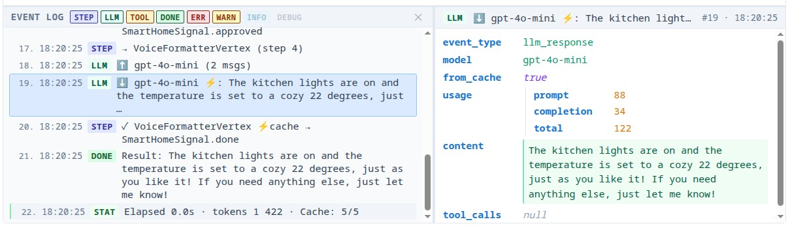
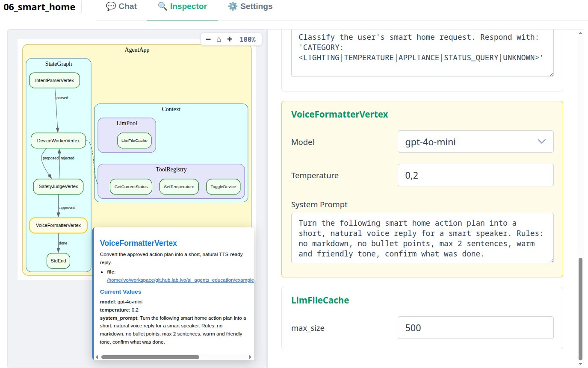
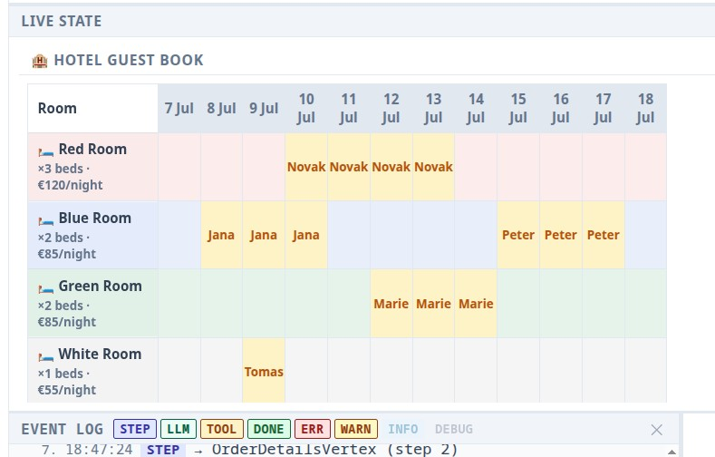

# Agentflow-kit — Declarative AI Agent Orchestration

> A lightweight, educational framework for building LLM agent workflows using a declarative
> state graph with deterministic Bulk Synchronous Parallel (BSP) execution.

<a href="img/agentflow-kit_illustration_1.jpg" target="_blank" title="Agentflow-kit illustration — full size">
  
</a>


## Why agentflow-kit?

Most agent frameworks treat execution as a black box. When your agent does something
unexpected, you trace logs, debug callbacks, and guess which piece of mutable state got
overwritten by which node and when. Testing requires mocking complex async machinery,
and reproducing a bug often means "just run it again and hope".

agentflow-kit is built around one idea: **if you can explain every step of execution
precisely, you can debug it, test it, and teach it.**

Three design decisions follow from that:

1. **BSP execution model** — every iteration is a fixed Compute → Barrier → Apply cycle.
   No scheduler surprises. Same input always produces the same execution trace.

2. **Immutable state + typed reducers** — state is a frozen dataclass. Every change is an
   explicit patch applied after the barrier. Parallel nodes cannot silently overwrite each
   other.

3. **Visualization as a first-class concern** — every object in the graph knows how to
   draw itself. No external service required. `graph --browser` works on every example,
   offline, out of the box.

The result is a framework that is more constrained than LangGraph or CrewAI — and better for
learning, prototyping, and building genuine understanding of agent architecture because of it.

## Quick Install

```bash
git clone https://github.com/ivomarvan/agentflow-kit.git
cd agentflow-kit
uv sync --extra dev          # editable install + tests
uv sync --extra gui --extra dev   # + local GUI server (FastAPI, Pygments)
```

`uv sync` links `agentflow/` from this repo into the venv (editable install).
Edit source files directly — no reinstall step needed.

## First Look

### Interactive GUI

Applications using `AgentApp` automatically receive a generated GUI with text and/or **voice** input.

<a href="img/chat_voicebot.jpg" target="_blank" title="Chat-voicebot GUI — full size">
  
</a>

In the graphical interface, you can see the **details of the state graph traversal** and **individual LLM calls** in real time.

<a href="img/event_log.jpg" target="_blank" title="Event log — full size">
  
</a>

You can view a **graphical representation of the state graph** with links to the code and **change LLM parameters during runtime**.

<a href="img/inspector.jpg" target="_blank" title="Inspector — full size">
  
</a>

You also have tools to easily create a **user interface for your domain model**.
(For example, the Guest book in the Hotel Booking application)

<a href="img/domain_live_model_guest_book.jpg" target="_blank" title="Guest book LiveModel panel — full size">
  
</a>

### Skeleton Generator

`agentflow/skeleton_generator.py` interactively creates a complete project skeleton —
`vertices/`, `tools/`, `state.py`, `<module>_app.py` — from a set of questions.

### LLM Caching

Each LLM connector has its own **cache**, so you don't waste tokens while debugging
with repeated queries.

### Automatic Tool Schema Generation

The JSON Schema describing the tools to the LLMs is generated directly from your Python tool definitions and type hints. This keeps your implementation and schema perfectly in sync.

```python
class Calculator(ToolBase):
    """Evaluate a simple arithmetic expression safely."""

    @param_desc(expression="Arithmetic expression using digits and +-*/() only, e.g. '19 * 23'")
    def execute(self, expression: str) -> str:
        """Evaluate the expression; reject any non-arithmetic input.

        Args:
            expression: Math expression string.

        Returns:
            String with the numeric result, or an error message.
        """
        # ... implementation ...
        pass

_registry = ToolRegistry([Calculator(), ...])
```

---

## Features

- **Declarative graph topology** — define agents as `StateVertex` subclasses, wire with `Transition` and `Parallel`
- **BSP execution model** — deterministic super-steps: Compute → Barrier → Apply & Route
- **Immutable state** — frozen dataclasses with typed reducers, no accidental mutation
- **Built-in visualization** — SVG/HTML/DOT graph rendering via `Describable`
- **AgentApp base class** — `AgentApp` provides CLI, graph visualization, `sample_prompts`, and `get_config_schema()` / `get_config()` / `set_config()` for GUI integration
- **Domain events** — `EventBus` + `AgentEvent` for vertex → GUI communication; subscribe custom handlers or inspect `bus.history`
- **Pydantic config** — `LlmConfig` is a `pydantic.BaseModel`; `model_json_schema()` powers the GUI settings panel
- **Checkpointing** — pluggable backends (Memory, JSON file, PostgreSQL, Redis)
- **Pause & resume** — `run_until(predicate)` + `resume(store, run_id, step)` for human-in-the-loop
- **LLM agnostic** — works with OpenAI, Anthropic, Ollama, Gemini, DeepSeek
- **LiveModel** — self-describing domain models with a standalone GUI panel (`@action` methods, Pydantic state)
- **mypy strict** — fully typed, zero-compromise type safety

## BSP Execution Model

Most agent frameworks use an **event-driven** model: nodes emit events, listeners react,
execution order depends on scheduling. This is flexible but has a fundamental cost —
non-determinism is built in.

agentflow-kit uses **Bulk Synchronous Parallel (BSP)**, a model from distributed computing
(Pregel, Apache Spark). Each iteration is a fixed three-phase cycle:

```
┌─────────────────────────────────────────────────────────────┐
│  Super-step N                                               │
│                                                             │
│  1. COMPUTE   All active vertices run in parallel           │
│               Each vertex reads state, produces a patch     │
│                                                             │
│  2. BARRIER   Wait for all vertices to finish               │
│               (no vertex sees another's output yet)         │
│                                                             │
│  3. APPLY     All patches merged into new frozen state      │
│               Routing signals determine next active set     │
└─────────────────────────────────────────────────────────────┘
         → Super-step N+1
```

### Why does this matter?

| Property | Event-driven | BSP |
|----------|-------------|-----|
| Execution order | Non-deterministic | Deterministic |
| Parallel write conflicts | Silent data races | Impossible (patches applied after barrier) |
| Reproducibility | Depends on scheduler | Same input → same output, always |
| Debuggability | Trace individual events | Inspect state snapshot after each super-step |
| Testability | Requires mocking scheduler | `FakeLlmConnector` + fixed input = deterministic test |
| Mental model | Callbacks / reactive | Sequential steps with explicit parallelism |

### Trade-off

BSP requires you to think in super-steps: what runs in parallel, where the barrier is.
This is more structure than most agent tasks need. For purely sequential workflows the
BSP overhead is invisible, but the conceptual model is always present.

agentflow-kit makes this trade deliberately: **correctness and inspectability over simplicity.**

---

## Framework Comparison

Three popular alternatives, an honest assessment.

### agentflow-kit vs. LangGraph

| | **agentflow-kit** | **LangGraph** |
|---|---|---|
| Execution model | BSP — deterministic, barrier-synchronized | Event-driven DAG with streaming |
| State | Frozen dataclasses + typed reducers | `TypedDict` (mutable, no conflict detection) |
| Parallel writes | Reducer-based merge, no races | Manual annotations required |
| Visualization | Built-in `Describable` → SVG/HTML/DOT | LangSmith (external, paid for teams) |
| Streaming tokens | ❌ not implemented | ✅ first-class |
| Checkpointing | Memory / JSON / PostgreSQL / Redis | PostgresSaver / RedisSaver |
| Pause & resume | `run_until()` + `resume()` | `interrupt_before/after` |
| Multi-turn state | `AgentApp` subclass pattern | Persistent thread via checkpointer |
| LLM support | OpenAI, Anthropic, Gemini, Ollama, DeepSeek (direct connectors) | Any LangChain-supported provider |
| Type safety | `mypy --strict` throughout | Partial (TypedDict is weakly typed) |
| Production maturity | 🔬 educational | ✅ production-ready, large community |
| Setup complexity | `uv sync` + `.env` | `pip install langgraph` + LangChain ecosystem |
| `LiveModel` GUI panel | ✅ | ❌ |

**When to pick LangGraph instead:** Streaming output is required, existing LangChain
tooling is in use, or production support and community size matter.

**When agentflow-kit is better for you:** You want to understand *why* the graph does
what it does, run offline without external services, or teach/learn agent design patterns.

---

### agentflow-kit vs. CrewAI

| | **agentflow-kit** | **CrewAI** |
|---|---|---|
| Abstraction level | Low — explicit graph + state | High — "Crew of Agents" with roles |
| Execution model | BSP state graph | Sequential / hierarchical process |
| State management | Explicit frozen dataclasses | Implicit, managed by framework |
| Parallelism | `Parallel(A, B)` in graph | `Process.hierarchical` (LLM orchestrator) |
| Graph definition | Code — `StateGraph`, `Transition` | YAML or Python agent/task descriptors |
| Streaming | ❌ not implemented | ✅ supported |
| Multi-agent coordination | Manual via graph topology | Built-in crew / delegation |
| Tool ecosystem | Custom `ToolBase` | LangChain tools + built-in CrewAI tools |
| Production maturity | 🔬 educational | ✅ production-ready |
| Observability | Built-in EventBus + GUI | External (Langfuse, OpenTelemetry) |
| Learning curve | Medium — must understand BSP + graph | Low — role/task vocabulary familiar from management |

**When to pick CrewAI instead:** You need multiple specialized agents collaborating with
role-based delegation, or the "crew as an organization" mental model matches your domain.

**When agentflow-kit is better:** You want explicit control over every decision in the
workflow, or the high-level "crew" abstraction hides too much from students.

---

### agentflow-kit vs. AutoGen (Microsoft)

| | **agentflow-kit** | **AutoGen** |
|---|---|---|
| Core paradigm | State graph with BSP runner | Conversational multi-agent (actor model) |
| State management | Explicit immutable state | Conversation history per agent |
| Execution control | Deterministic BSP steps | LLM-driven conversation termination |
| Graph topology | Explicitly defined | Emergent from agent conversations |
| Streaming | ❌ not implemented | ✅ supported |
| Human-in-the-loop | `run_until()` predicate | `HumanProxyAgent` |
| Type safety | `mypy --strict` | Partial |
| Offline use | ✅ `FakeLlmConnector` | Limited |
| Production maturity | 🔬 educational | ✅ v0.4 production-ready |
| Determinism | ✅ given fixed LLM outputs | ❌ LLM decides flow |
| Learning curve | Medium | Low start, steep for complex topologies |

**When to pick AutoGen instead:** The problem is genuinely conversational (agents
discuss and debate), or you want emergent coordination without defining a graph.

**When agentflow-kit is better:** You want full deterministic control over the execution
flow, clear state transitions, and the ability to explain exactly what happened and why.

---

### Summary

agentflow-kit is **not competing with** LangGraph, CrewAI, or AutoGen in production maturity
or feature breadth. It is competing in a different dimension: **transparency and teachability**.

The framework makes every design decision explicit and inspectable. That is its primary value
proposition. For production workloads, LangGraph is the pragmatic choice. For learning,
prototyping, and building confidence in agent architecture, agentflow-kit offers a uniquely
clear window into how agents actually work.

## Examples

### `framework/` — State machine mechanics (no LLM key needed)

| File | What it shows |
|------|---------------|
| [`examples/framework/01_hello_state_machine.py`](examples/framework/01_hello_state_machine.py) | `AgentApp` + minimal graph: two vertices, pure Python |
| [`examples/framework/02_parallel_and_loop.py`](examples/framework/02_parallel_and_loop.py) | `Parallel` fan-out/fan-in + review loop |
| [`examples/framework/03_live_graph.py`](examples/framework/03_live_graph.py) | `LiveGraphHooks` — DOT snapshot per super-step |
| [`examples/framework/04_checkpoint_resume.py`](examples/framework/04_checkpoint_resume.py) | Pause / resume with `InMemoryCheckpointStore` |
| [`examples/framework/05_counter_live_model.py`](examples/framework/05_counter_live_model.py) | `LiveModel` standalone demo |

### `agents/` — Agent patterns with a real LLM

| File | Pattern | LLM required |
|------|---------|:---:|
| [`examples/agents/01_tool_calling.py`](examples/agents/01_tool_calling.py) | Minimal ReAct: LLM + 2 tools | yes |
| [`examples/agents/02_react_agent.py`](examples/agents/02_react_agent.py) | Full ReAct: 4 tools, chained calls | yes |
| [`examples/agents/03_review_loop.py`](examples/agents/03_review_loop.py) | Retrieve → Generate → Review retry loop | no |
| [`examples/agents/04_pipeline.py`](examples/agents/04_pipeline.py) | Sequential multi-agent pipeline | yes |
| [`examples/agents/05_validated_tools.py`](examples/agents/05_validated_tools.py) | Guardrailed tools with input validation | yes |
| [`examples/agents/06_smart_home.py`](examples/agents/06_smart_home.py) | Worker/Judge loop with safety validation | yes |
| [`examples/agents/07_smart_home_live.py`](examples/agents/07_smart_home_live.py) | Worker/Judge + GUI Live State panel | yes |

### `examples/projects/` — Full applications

| Directory | Description | LLM required |
|-----------|-------------|:---:|
| [`examples/projects/hotel_booking/`](examples/projects/hotel_booking/) | Hotel booking voice assistant — multi-turn conversation, dynamic Pydantic schema, GUI guest book *(work in progress — functional but not yet fully polished)* | yes |

### Running examples

Every example script uses a unified CLI:

```bash
# Help (lists run, gui, describe, graph and all flags)
uv run python examples/framework/01_hello_state_machine.py -h

# No LLM key needed — pure Python state graph
uv run python examples/framework/01_hello_state_machine.py run

# Graph in browser / save HTML
uv run python examples/framework/02_parallel_and_loop.py graph --browser

# Requires .env with LLM_BACKEND + API key
uv run python examples/agents/06_smart_home.py run

# Full GUI chat + live state + event log
uv run python examples/agents/07_smart_home_live.py gui
uv run python examples/projects/hotel_booking/hotel_booking_app.py gui
```

Examples that require a real LLM read `LLM_BACKEND` and the corresponding API key from `.env`.
See the [Configuration](#configuration) section below.

## Documentation

- [`agentflow/README.md`](agentflow/README.md) — library overview + API reference
- [`agentflow/statemachine/README.md`](agentflow/statemachine/README.md) — StateGraph quick-start
- [`DESIGN_RULES.md`](DESIGN_RULES.md) — binding coding conventions for this codebase
- [`examples/README.md`](examples/README.md) — examples index with complexity ratings

## Testing

```bash
# Unit tests (no API keys required)
uv run pytest

# Integration tests (requires LLM API key + Docker services for DB backends)
uv run pytest -m integration
```

## Configuration

Copy `.env.example` to `.env` and set your LLM backend and API key:

```bash
cp .env.example .env
```

| Variable | Description | Example |
|----------|-------------|---------|
| `LLM_BACKEND` | Active backend | `openai` / `anthropic` / `ollama` / `gemini` / `deepseek` |
| `LLM_MODEL` | Model name | `gpt-4o-mini` / `claude-3-haiku-20240307` / `qwen2.5:7b-instruct` |
| `OPENAI_API_KEY` | Required for `openai` backend | `sk-...` |
| `ANTHROPIC_API_KEY` | Required for `anthropic` backend | `sk-ant-...` |
| `GOOGLE_API_KEY` | Required for `gemini` backend | `AIza...` |
| `DEEPSEEK_API_KEY` | Required for `deepseek` backend | `sk-...` |

For Ollama (local, free): install [Ollama](https://ollama.ai), pull a model
(`ollama pull qwen2.5:7b-instruct`), and set `LLM_BACKEND=ollama` — no API key needed.

## Project Status

Early-stage educational library. The core framework — state graph, BSP runner, LLM
connectors, GUI, LiveModel — is stable and covered by tests. Pluggable checkpoint
backends (PostgreSQL, Redis) are available but not yet hardened for production use.

Streaming tokens and typed signal validation are the next planned improvements.

## Contributing

Issues and pull requests are welcome.

Before writing code, read [`DESIGN_RULES.md`](DESIGN_RULES.md) — it defines the
conventions that keep the codebase consistent.

For significant changes, open an issue first to discuss the approach. Small fixes and
documentation improvements can go straight to a PR.

## License

Apache License 2.0 — see [`LICENSE`](LICENSE) for the full text.

Free to use, modify, and distribute — including in commercial products. Attribution
required: retain the copyright notice and license in any copy or derivative work.
Patent rights from contributors are explicitly granted and protected.

© 2026 Ivo Marvan

## AI-Assisted Development

This project is developed with [Cursor IDE](https://cursor.sh) using a custom set of
AI rules and skills in [`.cursor/`](.cursor/). The rules enforce coding conventions,
commit message format, and project structure. The skills automate common workflows
(APM task execution, Docker setup, commit + CI loop).

Exploring `.cursor/rules/` and `.cursor/skills/` is a good way to understand how
AI-assisted development can be structured for a non-trivial codebase.
